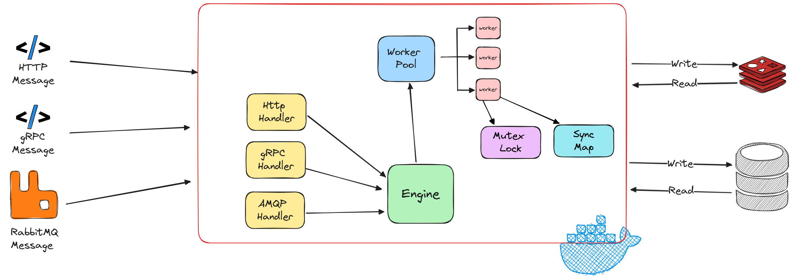
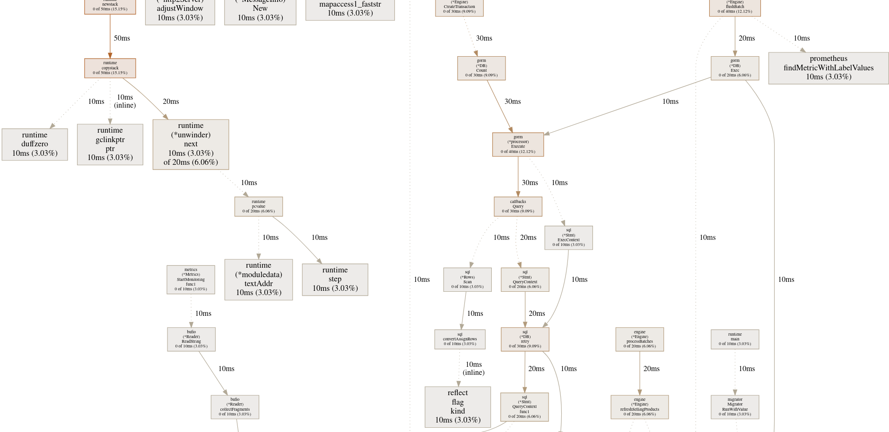

# Multi Tenant Transaction Service

This Microservice is responsible for handling transactions for multiple tenants with many branches and products.

## Run

```bash
make up
```
alternatively, you can run the following commands:

```bash
docker compose up -d
```

## Design




## Concurrency Techniques
The system uses a Fan-In, Fan-Out technique where multiple workers process transactions in parallel. It employs batch processing to group transactions together for efficient database updates. Workers handle tasks independently, and results are merged afterward. Synchronization ensures safe access to shared data throughout the process.

## Trade-offs
1. **Batch Processing**: The system uses batch processing to group transactions together for efficient database updates. This approach reduces the number of database calls and improves performance. However, it may introduce latency when processing large batches of transactions.
2. **Fan-In, Fan-Out**: The system uses a Fan-In, Fan-Out technique to process transactions concurrently. This approach improves throughput by distributing work among multiple workers. However, it may introduce complexity and require additional synchronization mechanisms to ensure data consistency.
3. **Cache**: The system uses an in-memory cache to store tenant and product information for quick access. This approach reduces the number of database calls and improves performance. However, it may introduce data consistency issues if the cache is not updated correctly, requires additional memory and synchronization mechanisms with other microservices.
4. **Synchronization**: The system uses synchronization mechanisms to ensure safe access to shared data among workers. This approach prevents data corruption and ensures data consistency. However, it may introduce performance overhead and complexity in managing shared resources.


## Run locally

First make sure that the service dependencies are up and running, then you can run the service locally:

```bash
source export.sh
make run
```
alternatively, you can run the following commands:

```bash
source export.sh
go run cmd/multi_tenant/main.go
```

## Race Detecting and Cpu Profiling

To run the program with a race detector, you can run the following command

```bash
make race
```

To run the program with a CPU profiler, you can run the following command

make sure to uncomment the following line in the [main.go](./cmd/multi_tenant/main.go) file

```go  
//defer profile.Start(profile.CPUProfile, profile.ProfilePath(".")).Stop()
//defer pprof.StopCPUProfile()
```

then run the program normally and load test it
```bash
make run
```
after stopping the program, you can generate the CPU profile by running the following command

```bash
make pprof-cpu
```

alternatively, you can run the following commands:

```bash
go tool pprof -http=":8000" pprofbin ./cpu.pprof
```

